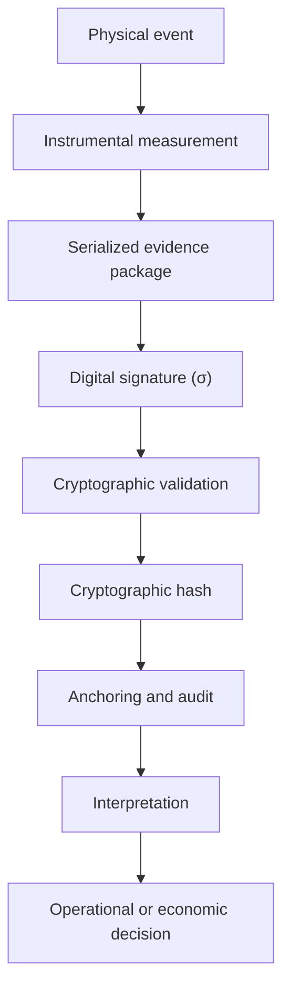
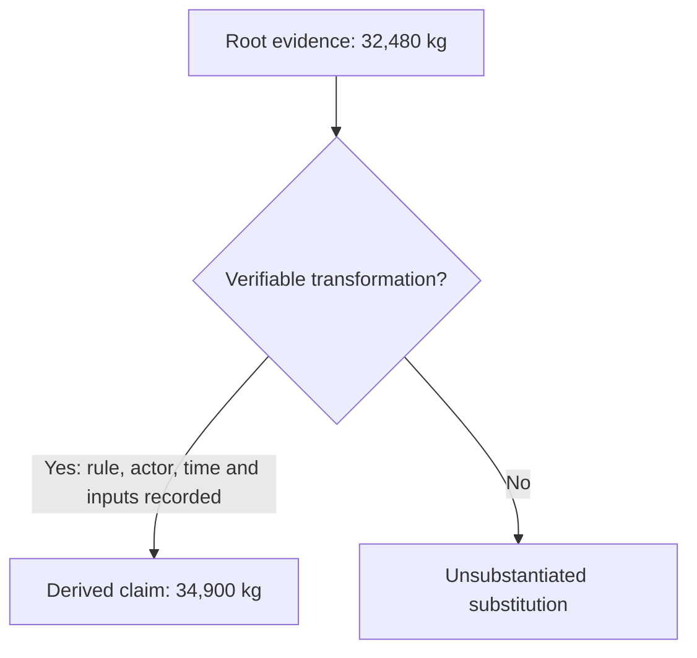

# PoWV Protocol

## PoWV Protocol

**Enterprise-grade infrastructure for Real-World Asset verification.**

PoWV is a verification infrastructure designed to strengthen the connection between physical operations and digital systems. It enables organizations to establish reliable evidence about real-world assets and events before those records are used for audit, compliance, financing, insurance, or digital settlement.

> **Verifiable physical truth creates economic certainty.**

### The core question

Modern industries generate value through logistics, commodities, environmental processing, infrastructure, and industrial operations. Yet a fundamental question remains:

> How can physical claims become independently verifiable without depending exclusively on manual records or centralized trust?

PoWV addresses this gap through a secure evidence and verification framework.

### What PoWV enables

* Stronger confidence in records associated with physical assets
* Independent verification and auditability
* Reduced exposure to duplicated or manipulated claims
* Interoperability between operational and digital environments
* A trusted foundation for Real-World Asset systems

## Epistemic Architecture and Data Chain of Custody

PoWV treats every physical claim as the result of a traceable sequence. A real-world event is measured by an identified instrument; the measurement is bound to context and device identity; the resulting evidence is transported, verified, anchored, and only then interpreted for operational or economic decisions.


**Core invariant:** no downstream layer should be able to silently rewrite an earlier layer. A later interpretation may challenge, qualify, or supersede a decision, but it must not impersonate the evidence from which it was derived.


### Evidence about reality, not reality itself

#### Canonical notation

The following symbols define the conceptual sequence used throughout the PoWV evidence model:

| Symbol | Meaning                                          |
| ------ | ------------------------------------------------ |
| `E`    | Physical event                                   |
| `M`    | Measurement or instrument-generated event record |
| `P`    | Serialized evidence package                      |
| `σ`    | Digital signature                                |
| `V`    | Cryptographic validation                         |
| `H`    | Cryptographic hash                               |
| `A`    | Anchoring and audit record                       |
| `I`    | Downstream interpretation                        |

$$
E \rightarrow M \rightarrow P \rightarrow \sigma
$$

$$
\sigma \rightarrow V \rightarrow H \rightarrow A \rightarrow I
$$

This notation preserves the distinction between the originating physical event, the evidence produced about it, the cryptographic controls applied to that evidence, and the interpretation constructed afterward.

PoWV does not claim that a sensor captures reality without mediation. Let `E` represent a physical event. The instrument produces a measurement `M` as a function of the event, the sensor, its calibration, the operating conditions, and measurement uncertainty:

$$
M = f(E, S, C, \varepsilon)
$$

Therefore, `M` is not identical to `E`. It is an instrumentally produced representation of one or more properties of that event. The defensible claim is narrower and stronger:

> **This value was produced by this identified device, at this time, under these recorded conditions, and it was not subsequently replaced without leaving verifiable evidence.**

The measurement and its declared metadata are serialized into an evidence package:

$$
P = \text{serialize}(M, \text{metadata})
$$

The identified device signs that package:

$$
\sigma = \text{sign}(k, P)
$$

The receiving system validates the package and signature, computes the cryptographic hash, and produces an anchoring or audit record:

$$
V = \text{verify}(pk, \sigma, P)
$$

$$
H = \text{hash}(P, \sigma)
$$

$$
A = \text{anchor}(H, V)
$$

The resulting evidence lineage is:

$$
E \rightarrow M \rightarrow P \rightarrow \sigma
$$

$$
\sigma \rightarrow V \rightarrow H \rightarrow A
$$

Interpretation remains explicitly downstream:

$$
I = g(M, A, R, B, \ldots)
$$

where `R` represents applicable rules and `B` represents business or operational context. This separation prevents an inference from being retroactively presented as the original measurement.

### Trust model by layer

| Layer                      | What it establishes                                                               | What it does not establish by itself                     |
| -------------------------- | --------------------------------------------------------------------------------- | -------------------------------------------------------- |
| Physical event             | The real-world occurrence under observation                                       | A complete digital description of the event              |
| Measurement                | A device-generated observation of a defined property                              | Absolute truth, correct calibration, or complete context |
| Edge attestation           | Device-linked authorship, integrity, time, and relevant metadata                  | That the physical setup was legitimate or uncompromised  |
| Transport                  | Delivery across RS-485, MQTT/TLS, LTE, satellite, Wi-Fi, or another channel       | The semantic truth of the payload                        |
| Verification and anchoring | Signature validation, integrity checks, ordering, and durable evidence references | The correctness of every upstream physical condition     |
| Interpretation             | Rules, analytics, AI, compliance analysis, and business meaning                   | Authority to overwrite the originating evidence          |

This model deliberately avoids requiring trust in the messenger. The transport layer may be unreliable or even hostile while the receiving system still verifies whether the evidence remains cryptographically bound to its origin.

$$
H^{(0)} = \text{hash}(P^{(0)}, \sigma^{(0)})
$$

$$
H^{(1)} = \text{hash}(P^{(1)}, \sigma^{(1)})
$$

$$
H^{(0)} = H^{(1)}
$$

$$
V = \text{verify}(pk, \sigma, P^{(1)})
$$

$$
V = \text{true}
$$

These checks establish continuity between the edge record and the received record. They do not erase the need for calibration, device security, maintenance, environmental controls, or operational governance.

### Observed evidence and derived claims

A load cell may record `32,480 kg`. It does not know whether a contract was fulfilled, whether a shipment was fraudulent, or whether a billing rule was correctly applied. If a downstream system later presents `34,900 kg`, that transformation must have an explicit and auditable genealogy: the rule applied, the responsible actor or service, the timestamp, the inputs, and the resulting output.

The architecture therefore permits interpretive plurality without retrospective mutability of evidence. The same anomaly may support competing hypotheses—fraud, operational error, sensor fault, or a legitimate exception—but each conclusion must remain distinguishable from the evidence used to produce it.

### Multi-sensor reconstruction

Each instrument is intentionally narrow. A load cell measures weight. GNSS produces location and time coordinates. An accelerometer measures motion. Device identity indicates which trusted hardware produced an attestation. None of these signals independently understands the full business event.

PoWV can combine partial observations into an operational representation while preserving the distinction between what was directly observed and what was reconstructed:

$$
\{M_1, M_2, M_3, \ldots, M_n\} \rightarrow O
$$

$$
\text{observed measurements} \neq \text{reconstructed operational model}
$$

This distinction is especially important for AI-assisted analysis. A conclusion should be traceable backward—from the model output, to the rules and features used, to the signed observations, to the originating device and its recorded state.

### What the protocol is designed to preserve

* **Provenance:** which identified device or authorized source produced the evidence
* **Integrity:** whether the record changed after attestation
* **Context:** when, where, and under which declared conditions the observation occurred
* **Transformation lineage:** how measured values became normalized, aggregated, classified, priced, or settled values
* **Layer separation:** the boundary between observation, interpretation, and decision
* **Auditability:** the ability to move from a downstream claim back to its originating evidence


PoWV does not convert authenticated evidence into infallible truth. A valid signature cannot prove that a sensor was correctly installed, calibrated, or physically uncompromised. These risks must be addressed through device security, calibration records, operational controls, redundancy, anomaly detection, and governance.


### Defining principle

> **PoWV does not attempt to prevent different interpretations of reality. It attempts to prevent a later interpretation from masquerading as the evidence that originated it.**

The protocol subjects downstream representations to a verifiable chain of instrumental evidence, preserving provenance, integrity, and the separation between what was measured at the origin and what was later inferred from that measurement. This is the foundation of a defensible physical-to-digital chain of custody.

### Explore the documentation

* The Problem
* [Architecture](architecture/)
* [Verifiable Evidence](verifiable-evidence/)
* [Industrial Connectivity](industrial-connectivity/)
* Use Cases
* [Security](security/)
* [Project Status](project-status/)

### Official channels

* [www.powvprotocol.com](https://www.powvprotocol.com)
* [www.powvprotocol.org](https://www.powvprotocol.org)

**Executive Contact:** [gabriel@powvprotocol.com](mailto:gabriel@powvprotocol.com)


This public documentation presents PoWV at an institutional and conceptual level. Firmware logic, security parameters, industrial integration methods, implementation sequences, credentials, and proprietary technical material are restricted.

