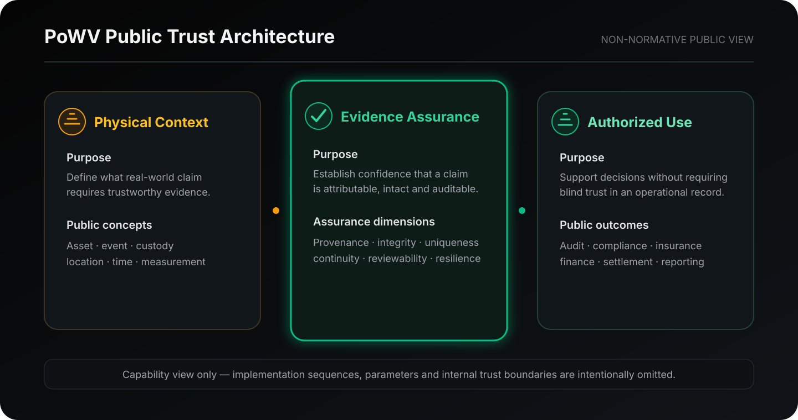

# Architecture

PoWV is organized as a modular assurance framework for connecting physical claims with authorized digital use.


This diagram is a non-normative capability view. It does not represent firmware execution order, network topology, or an implementation specification.


## Three public trust domains

| Domain             | Core question                                                                                                          | Public outcome                                                          |
| ------------------ | ---------------------------------------------------------------------------------------------------------------------- | ----------------------------------------------------------------------- |
| Physical Context   | What real-world asset, event, measurement, location, or custody relationship is being claimed?                         | A bounded claim that can be evaluated                                   |
| Evidence Assurance | Can the claim be attributed, checked for integrity, distinguished from conflicting claims, and independently reviewed? | A defensible evidence position                                          |
| Authorized Use     | Which approved system or institution may rely on the result, and for what purpose?                                     | Audit, compliance, insurance, finance, reporting, or settlement support |

## Architectural characteristics

* **Modular:** deployment context can change without redefining the protocol's public assurance objectives.
* **Evidence-centered:** the system evaluates support for a claim rather than accepting an assertion as truth.
* **Multi-signal:** stronger confidence may be constructed from complementary evidence sources; no single signal is assumed to be sufficient in every deployment.
* **Reviewable:** an authorized reviewer should be able to understand why a claim was accepted, rejected, or routed for exception handling.
* **Connectivity-aware:** the assurance model is designed for both connected and constrained operating environments.
* **Controlled-disclosure:** public documentation explains capabilities while implementation-critical material remains restricted.

## Explore this architecture

* [Trust Domains](trust-domains.md)
* [Design Principles](design-principles.md)
* [Deployment Profiles](deployment-profiles.md)
