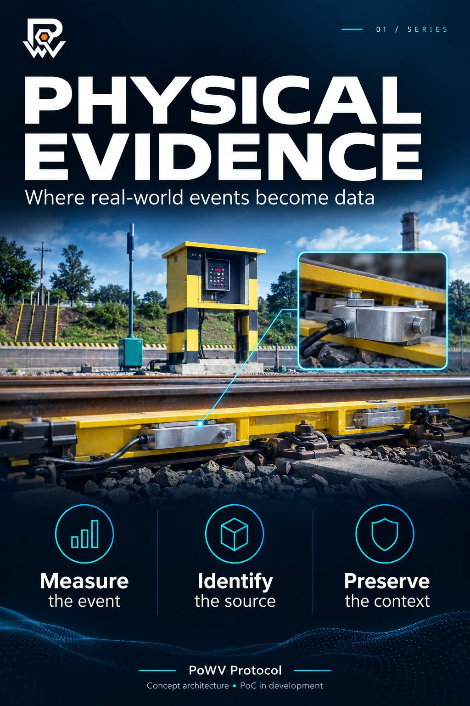
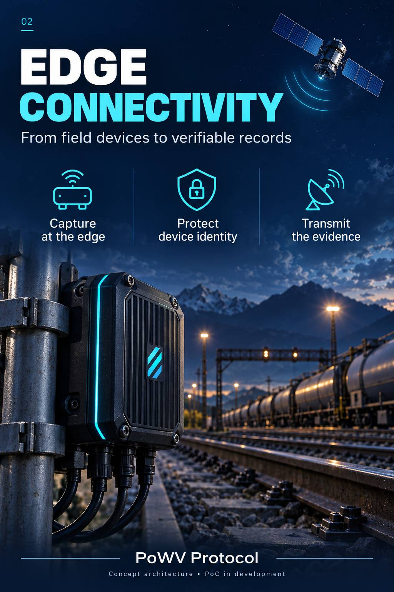

# Digital Twin, ERP Integration & Trade Finance

From physical event capture to digital asset representation and the use of evidence in business and financial processes.

## Integration thesis

PoWV proposes an evidence layer between physical operations and the systems that record, move or finance assets. The proposed architecture connects edge capture, device identity, record integrity, transmission, digital representation and enterprise integration.

Its value lies in the ability to reconstruct the origin of information and examine its continuity throughout the process.

> **Development status:** conceptual illustrations of the proposed architecture. Proof of concept in development.

## 1. Physical Origin & Engineering

The architecture begins with an observable event: a weighing operation, movement, instrument reading or operational state change. The proposed design associates that event with a device, a context and a verifiable record.

Measurement quality requires its own assessment. Protecting a record against alteration does not, by itself, demonstrate that an instrument measured accurately.

## 2. Topology & Connectivity

The proposed architecture has four functions:

| Function                              | Intended role                                                                           |
| ------------------------------------- | --------------------------------------------------------------------------------------- |
| Edge nodes                            | Capture observations and identify their operational origin.                             |
| Terrestrial or satellite connectivity | Transport records according to availability and deployment profile.                     |
| Security component                    | Protect identity, keys and cryptographic operations according to the selected hardware. |
| L2 anchoring                          | Record a verifiable reference to the content according to the implemented integration.  |

Component selection and integration require verification during implementation.

## 3. Evidence, Payload & Geographic Context

The proposed model combines device and asset identifiers, measurement, geographic context, associated evidence and the record signature. A content reference links an event to its supporting documentation.

The payload specification must define each field's size and encoding, coordinate precision, version, signature and interpretation rules.

### Geofencing and spatial binding

The proposed geofence compares the reported location with the expected operating area. Including coordinates in the signed content protects their association with the record; location reliability still depends on the source and its validation.

## 4. Digital Twin & ERP Integration

The digital twin is presented here as an asset representation linked to its events and evidence. Its creation should preserve the relationship between asset identity, observations and state history.

**Hylomorphism**, in the conceptual vocabulary of this proposal, describes the relationship between the material asset and its informational form. The term does not replace technical definitions of data and validation rules.

### Proposed integration workflow

1. Capture the physical event and record its context.
2. Verify the quality, identity and integrity requirements defined for the event.
3. Transmit and receive evidence with failure and duplicate handling.
4. Update the digital asset representation.
5. Send the accepted event to the ERP through an authorized interface.
6. Record acceptance, rejection or the need for review.
7. Make the evidence available to eligible financial processes.

SAP and TOTVS are references to enterprise systems. Inventory adjustments must be defined by the business process and depend on the destination system accepting the event.

### Zero Trust as a design principle

The proposal requires explicit checks at each system boundary: origin, authorization, integrity, continuity and destination acceptance. A green interface indicator should correspond to an identifiable check and an inspectable record.

## 5. Trade Finance & Parametric Insurance

The financial thesis is to provide traceable evidence for assessing transactions backed by physical assets. The digital representation can serve as an information reference for asset assessment and monitoring.

Under the proposed architecture, credit approval belongs to the responsible institution and the transaction's rules; token issuance alone should not trigger approval.

Likewise, a parametric insurance workflow should distinguish observation, trigger validation and execution decisions. Arbitrum and DREX are references within the conceptual scenario, without a claim of partnership or verified operational integration.

## 6. From Demonstration to Validation

| Stage                  | Evidence to produce                                                                 |
| ---------------------- | ----------------------------------------------------------------------------------- |
| Capture                | Test records, measurement conditions and interface behavior.                        |
| Security               | Signature verification and tests of tampering, replay and identity.                 |
| Connectivity           | Transmission, reception, failure and recovery logs.                                 |
| Digital representation | Correspondence between the asset, events and state changes.                         |
| ERP                    | Processing confirmations, rejection and duplicate prevention in a test environment. |
| Financial workflow     | Documented rules and evidence of acceptance by the responsible party.               |

These items form a validation agenda, rather than completed results.

## Documentation & Technical Access

This page publicly presents the thesis and visual material. Detailed specifications, firmware and implementation documents may form a controlled-access technical package, as made available by the owner.

**Owner-provided contact:** [gabriel@powvprotocol.com](mailto:gabriel@powvprotocol.com)

[Bench development record and test authorship](research-and-theses/from-architecture-to-bench.md) · [Research & Theses](research-and-theses/)

***

## Authorship, Maintenance & Intellectual Property

**Gabriel de Almeida Santos Silva**\
Creator and owner of PoWV Protocol. Author of the concept and original development contributions presented here.

**Maintained by 58.046.660 Gabriel de Almeida Santos Silva**\
**CNPJ: 58.046.660/0001-93**

I claim intellectual property ownership over my original contributions to the architecture, development and documentation of PoWV Protocol, respecting third-party rights in the components, tools and technologies used.

**Author's signature:** Gabriel de Almeida Santos Silva\
© 2026 PoWV Protocol. All rights reserved.
