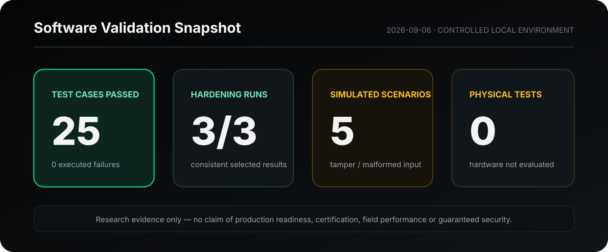

# Validation Evidence

This page records a sanitized public summary of a controlled local validation of the PoWV Virtual Lab proof of concept.


“Zero executed failures” refers only to the 25 test cases included in the selected validation set. A separate initial harness invocation and repository-wide test collection encountered reproducibility issues described below.


## Validation identity

| Item              | Recorded value                                             |
| ----------------- | ---------------------------------------------------------- |
| Validation date   | September 6, 2026                                          |
| Source snapshot   | `104b84dc3adea058733f55dbe080b79364fbafef`                 |
| Branch            | `main`                                                     |
| Environment       | Windows, Python 3.11.9, existing local virtual environment |
| Execution mode    | Local software simulation                                  |
| External network  | Not used                                                   |
| Physical hardware | Not used                                                   |

## Scope

The audit evaluated selected deterministic software behavior associated with:

* compact event-evidence handling at the software boundary;
* malformed-input rejection;
* simulated telemetry-change detection;
* local evidence creation and verification;
* selected administrative protection behavior;
* repeated-run consistency.

The audit did **not** evaluate production deployment, certification, legal compliance, external network behavior, field performance, or physical equipment.

## Executed results

| Test category                                           | Executed cases | Result     |                      Evidence level |
| ------------------------------------------------------- | -------------- | ---------- | ----------------------------------: |
| Selected hardening checks across three independent runs | 18             | Passed     |                Verified in this run |
| Simulated telemetry check                               | 1              | Passed     |                Verified in this run |
| Simulated tamper and malformed-input scenarios          | 5              | Passed     |                Verified in this run |
| Local verification smoke check                          | 1              | Passed     |                Verified in this run |
| **Total**                                               | **25**         | **Passed** | **Controlled software environment** |

## Observed capabilities

| Capability                           | Public conclusion                                                                               |
| ------------------------------------ | ----------------------------------------------------------------------------------------------- |
| Software-boundary input handling     | Selected malformed or unexpected input conditions were rejected in the tested environment       |
| Evidence generation and verification | The local test suite demonstrated creation and verification of audit evidence                   |
| Simulated tamper handling            | Five simulated alteration or malformed-input scenarios produced the expected rejection behavior |
| Repeated-run consistency             | The selected hardening checks passed in all three independent runs                              |
| Physical operation                   | Not evaluated                                                                                   |
| End-to-end service operation         | Not evaluated                                                                                   |

## Metrics

| Metric                                        | Result       |
| --------------------------------------------- | ------------ |
| Selected executed cases passed                | 25           |
| Selected executed cases failed                | 0            |
| Hardening-run consistency                     | 3 / 3        |
| Simulated tamper or malformed-input scenarios | 5 passed     |
| Latency                                       | Not measured |
| Throughput                                    | Not measured |
| Physical-link quality                         | Not measured |
| Energy consumption                            | Not measured |
| Audit-resolution time                         | Not measured |

## Reproducibility limitations

* The observed runtime was Python 3.11.9, while the repository documentation names Python 3.12 as a prerequisite.
* Repository-wide automatic test collection was not clean because duplicate test-module naming in a nested workspace tree caused collection conflicts.
* One initial smoke-test invocation failed because the repository import context was incomplete; the corrected invocation passed and the initial failure was retained in the audit record.
* Some integration tests require running service processes and persistent local state that were not started during this audit.
* Recovery, connectivity, persistent duplicate handling, and physical-link behavior remain untested.
* Results apply only to the recorded source snapshot and environment.

## Research demonstration vs. production readiness

The evidence supports a proof-of-concept demonstration of selected software behaviors. It does not support claims of:

* production readiness;
* independent certification;
* guaranteed security;
* legal or regulatory compliance;
* enterprise deployment;
* satellite, serial, radio, or industrial-link performance;
* validated latency, throughput, reliability, or energy targets.

Additional independent review, end-to-end testing, operational controls, reproducible benchmarks, and authorized physical-bench validation are required before making those claims.

## Disclosure notice

This public summary intentionally excludes source code, commands, internal paths, exact protocol characteristics, cryptographic and provisioning procedures, internal interfaces, hardware information, credentials, failure traces, and deployment-specific configuration.

Detailed audit evidence remains restricted.
