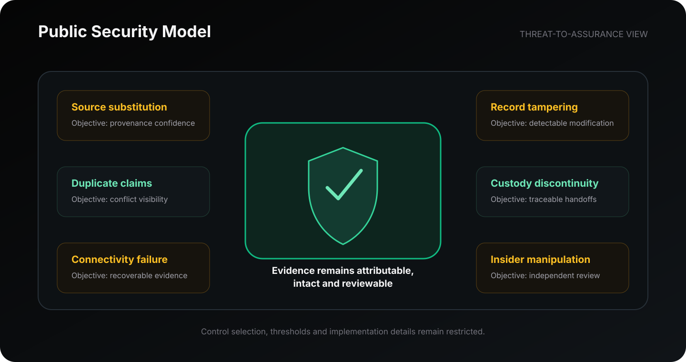

# Security

PoWV applies a defense-in-depth philosophy to the physical-to-digital boundary. The public model begins from a simple assumption: devices, networks, operators, organizations, and software can fail or be manipulated.

## Public security objectives

| Threat class                    | Security objective                                           |
| ------------------------------- | ------------------------------------------------------------ |
| Source substitution             | Preserve confidence in the origin and context of a claim     |
| Record tampering                | Make unauthorized modification detectable                    |
| Duplicate or conflicting claims | Expose reuse, repetition, or inconsistency                   |
| Custody discontinuity           | Maintain reviewable continuity across handoffs               |
| Connectivity failure            | Preserve evidence for controlled recovery and reconciliation |
| Insider manipulation            | Avoid dependence on a single unreviewable authority          |

## Security is an assurance argument

PoWV does not describe security as one algorithm, device, or network. Security is the combined argument that:

* the source context is defensible;
* evidence integrity can be assessed;
* conflicting claims can be surfaced;
* exceptions remain reviewable;
* authorized parties can evaluate the basis of a decision.

## Explore security

* [Threat Model](threat-model.md)
* [Disclosure Boundary](disclosure-boundary.md)

Security reports: **powv.protocol@proton.me**
