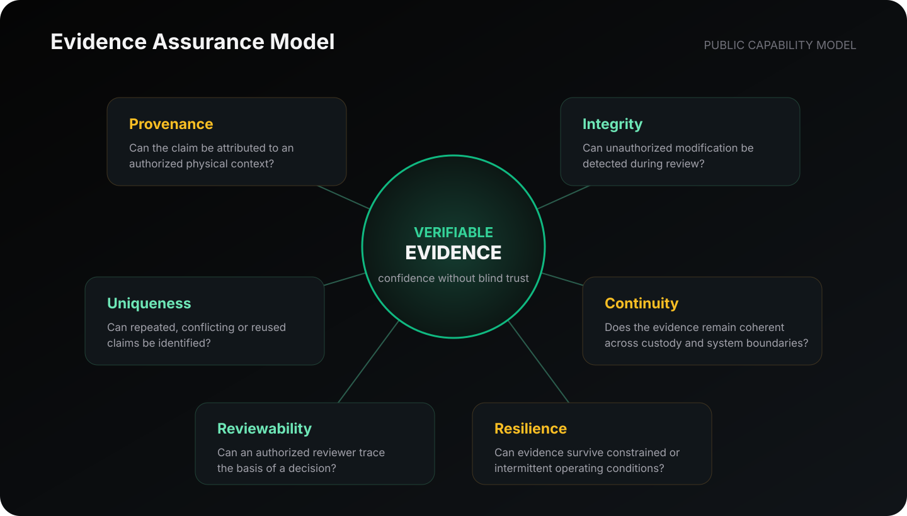

# Verifiable Evidence

PoWV treats evidence as a structured basis for evaluating a physical claim, rather than as an isolated file, sensor reading, or database row.

## Six assurance dimensions

| Dimension     | Evaluation question                                                                     |
| ------------- | --------------------------------------------------------------------------------------- |
| Provenance    | Can the claim be associated with an authorized physical and operational context?        |
| Integrity     | Can unauthorized modification be detected during review?                                |
| Uniqueness    | Can repeated, conflicting, or reused claims be identified?                              |
| Continuity    | Does the evidence remain coherent across custody and system boundaries?                 |
| Reviewability | Can an authorized reviewer trace the basis of a decision?                               |
| Resilience    | Can evidence remain usable when operations face constrained or intermittent conditions? |

A claim may be strong in one dimension and weak in another. PoWV's public model therefore avoids treating “verified” as a single unexplained label.

## Evidence outcomes

At a public conceptual level, evidence evaluation may lead to:

* **supported:** the available evidence satisfies the applicable assurance policy;
* **exception:** the evidence requires authorized review or additional support;
* **unsupported:** the claim does not satisfy the applicable assurance requirements.

These are assurance outcomes, not descriptions of internal decision rules.

## Explore the evidence model

* [Evidence Model](evidence-model.md)
* [Assurance Metrics](assurance-metrics.md)
